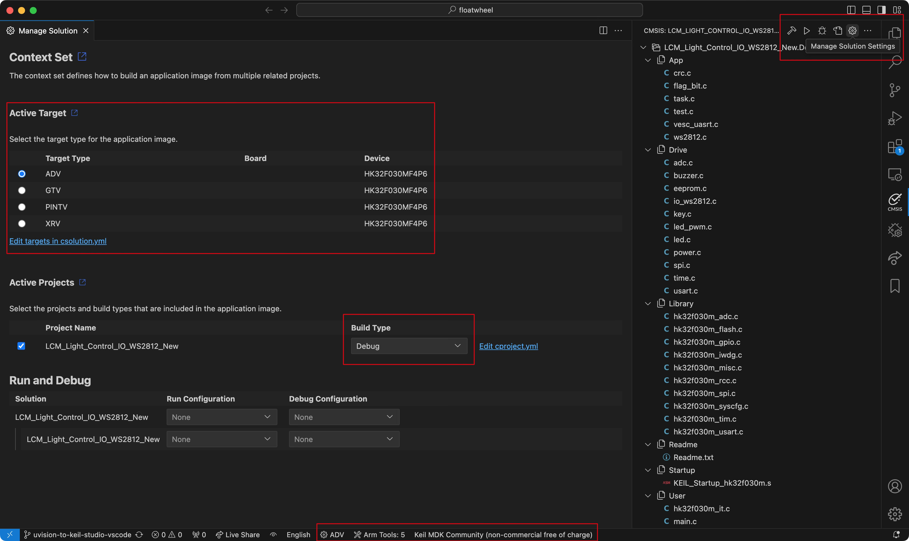

# Floatwheel LCM Firmware

#### Linux Prerequisites

1. Install `libncurses5` via your package manager of choice

## Setting up the project

1. Install [Visual Studio Code](https://code.visualstudio.com)
1. Open `floatwheel` folder in Visual Studio Code
1. Install [Keil Studio Pack](https://marketplace.visualstudio.com/items?itemName=Arm.keil-studio-pack) extension [^1]
1. Wait for Arm Tools to finish downloading / installing [^2][^3]
1. Activate Keil MDK Community license when prompted
1. Open a terminal in Visual Studio Code
1. Input `cpackget add LCM/HKMicroChip.HK32F030xMxx_DFP.1.0.17.pack` and press Enter/Return [^4]
1. Use CMSIS tab to select target device and build / debug[^5]

Build scripts are also included: `LCM/build.sh` (Linux / Mac OS) `LCM/build.bat` (Windows) 

They build firmware for all 4 configurations, then copy the created `<device>_<version>.hex` files into the `LCM` directory. The intention is to use them when releasing new versions until a future solution is reached.

[^1]: This should be suggested automatically
[^2]: Located on the bottom bar, will show either Arm Tools: x or Installing...(xx%)
[^3]: This process takes quite some time. Check `Output -> Arm Tools` for details
[^4]: Try adding `~/.vcpkg/artifacts/2139c4c6/tools.open.cmsis.pack.cmsis.toolbox/2.6.1/bin/` to $PATH if you're having issues running cpackget
[^5]: .hex file located at `LCM/Project/MDK5/out/LCM_Light_Control_IO_WS2812_New/<device>` in Debug / Release folder
